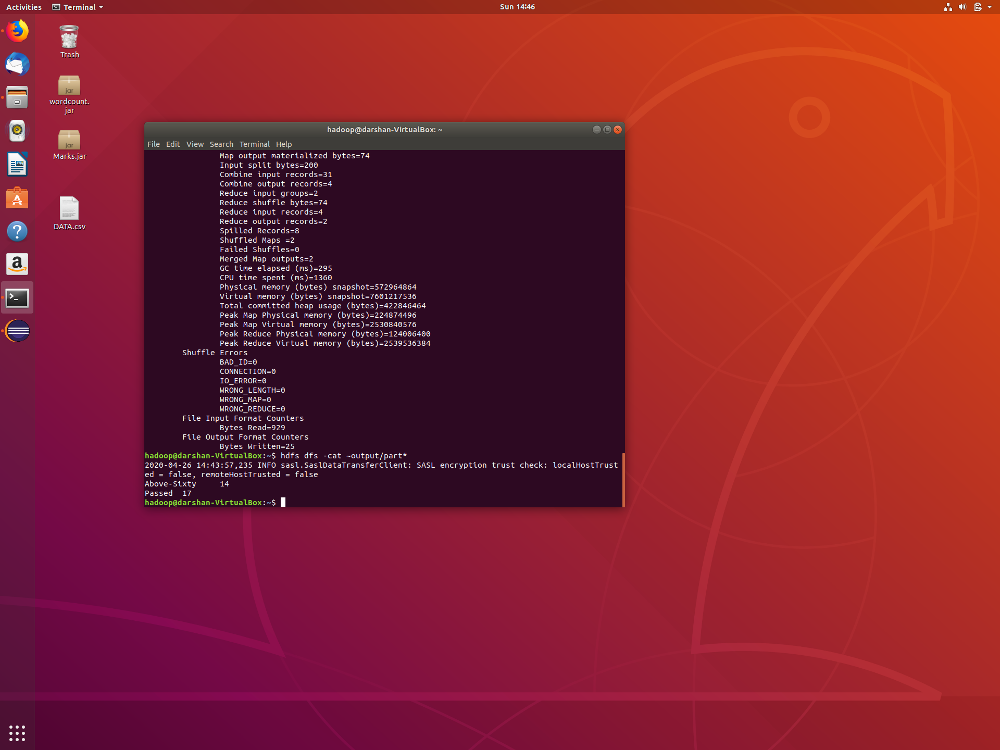

# Hadoop Mapreduce 

PROBLEM:

Create data set in excel as .csv file and it should contan the following fields at least 20 sample dataset in it:

Name	USN	Subject1	Subject2	Subject3	Pass/Fail
Akul	1NT16IS021	56	64	74	YES

Use the Hadoop mapreduce programming framework to comeupwith a program which will take the data from this .csv  file and compute the following

1. Total number of students who have scored more than 60 in suject 1
2. Total number of students who have passed in all subjects

# Screenshot Of EXCEL Sheet

  
  This is the excel sheet of we prepare. In this excel sheet 14 students take above 60 marks in a subject1, and the total number of passed students are 17 and failed students are 3. This is what the program can do. Here is a screenshot of the result which is calculated by mapreduce  java program 
  
  # Screenshot of Output:
  
  
 # Commands For running the program
 
 <b>Start hdfs service:</b>

First we have to go to sbin folder Then enter the command 

    start-all.sh 
    Wait for 10 seconds to start all deamons

<b>Check the availability of all the nodes</b>

    Jps is a command to check all the deamons are started or not

<b>Create Input directory</b>

    hdfs dfs -mkdir [NAME]
    
<b>Example:</b>

    hdfs dfs -mkdir ~/input

<b>Move dataset to Input directory</b>

    hdfs dfs -put [DATSET_PATH[INPUT_DIRECTORY]
<b>Example:</b>

    hdfs dfs -put /home/hadoop/Desktop/data.csv ~/input

<b>Run The MapReduce program with created JAR file:</b>

    hadoop jar [JAR_PATH] [INPUT_DIRECTORY] [OUTPUT_DIRECTORY]
    
<b>Example:</b>

    hadoop jar /home/hadoop/Desktop/Marks.jar ~/input ~/output

<b>Output:</b>

    hdfs dfs -cat /[OUTPUT_DIRECTORY]/part*
    
<b>Example:</b>

    hdfs dfs -cat /output/part*
